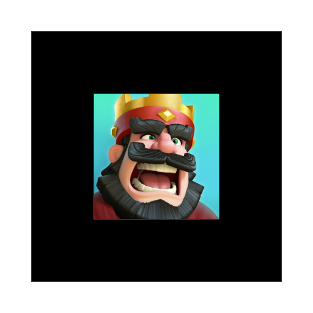

# A FRAME

## Introdución

[Ver..](https://elberfeld2.github.io/js3d/a_frame/introducion.html)

## Vista 360

Ejemplo de vr con fotos 360

[Ejemplo](https://elberfeld2.github.io/js3d/a_frame/ecenario.html)

[Mi proyecto](https://elberfeld2.github.io/js3d/a_frame/escenario2.html)

[Vista 360 con comandos por voz](https://elberfeld2.github.io/js3d/a_frame/escenarioVoz.html)

## Inicial AR

Ejemplo de vr con un archivo obj (Atronauta) con el marker hiro

[Ver..](https://elberfeld2.github.io/js3d/a_frame/inicial.html)

## Clash

Ejemplo vr con obj y marker propio generado en [ArJsStudio](https://ar-js-org.github.io/studio/)

[Ver..](https://elberfeld2.github.io/js3d/a_frame/M1.html)

## GPS

Ejemplo vr con imagen de clash 

[Ver..](https://elberfeld2.github.io/js3d/a_frame/M2.html)

## GPS modelo

Ejemplo vr con modelo gltf

[Ver..](https://elberfeld2.github.io/js3d/a_frame/M3.html)

## Static modelo

Ejemplo vr con modelo Static

[Ver..](https://elberfeld2.github.io/js3d/a_frame/M5.html)

## Interación

Interación entre dos marcadores.

[Ver..](https://elberfeld2.github.io/js3d/a_frame/interacion.html)

